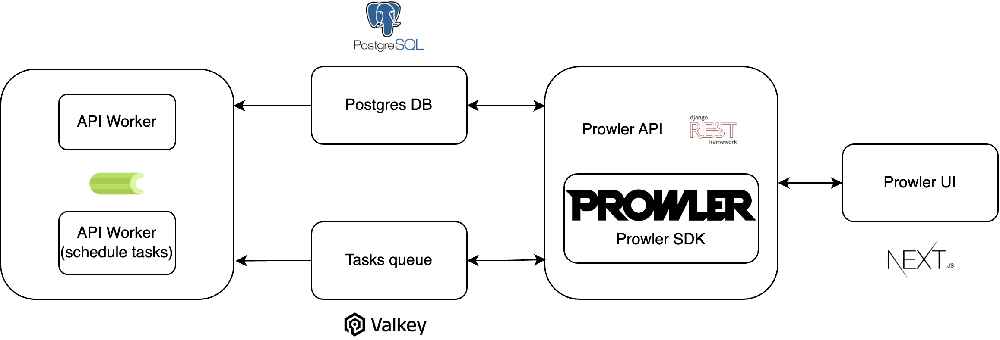

# Prowler Helm Chart

Prowler is an Open Cloud Security tool for AWS, Azure, GCP and Kubernetes. It helps for continuos monitoring, security assessments and audits, incident response, compliance, hardening and forensics readiness. Includes CIS, NIST 800, NIST CSF, CISA, FedRAMP, PCI-DSS, GDPR, HIPAA, FFIEC, SOC2, GXP, Well-Architected Security, ENS and more.

This is a Chart for the [Prowler App](https://docs.prowler.com/projects/prowler-open-source/en/latest/#prowler-app), not the [Prowler Dashboard](https://docs.prowler.com/projects/prowler-open-source/en/latest/#prowler-dashboard).

## Architecture

The Prowler App consists of three main components:

- **Prowler UI**: A user-friendly web interface for running Prowler and viewing results, powered by Next.js.
- **Prowler API**: The backend API that executes Prowler scans and stores the results, built with Django REST Framework.
- **Prowler SDK**: A Python SDK that integrates with the Prowler CLI for advanced functionality.

The app leverages the following supporting infrastructure:

- **PostgreSQL**: Used for persistent storage of scan results.
- **Celery Workers**: Facilitate asynchronous execution of Prowler scans.
- **Valkey**: An in-memory database serving as a message broker for the Celery workers.

## Contributing

Feel free to contact the maintainer of this repository for any questions or concerns. Contributions are encouraged and appreciated.